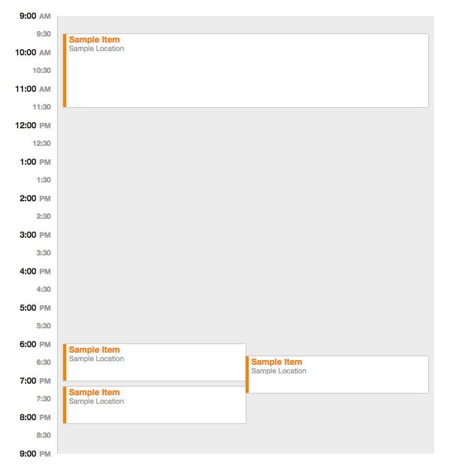

# daily agenda
A Full Blown way to show a daily agenda of events.  Will probably end up using this
on a wall mounted iPad.  The display is similar to a "day view" or "single day calendar" view
you'd see in your favorite neighborhood calendaring app.



## Requirements to build (global deps)
- [node](http://nodejs.org)
- [gulp](http://gulpjs.com)

## To build
```
npm install && gulp
```

Built package is created under `dist` directory.

## Assumptions
- don't care about text getting cut off (for now)
- visual spanning is based on columns needed in groups of clusters (need to fix this after condensed code changes)
- not responsive (could easily change this since all positions are % based)
- example type of data as grokked from real world events:
```
var mock = [
    {"start": 30, "end": 150},
    {"start": 20, "end": 100},
    {"start": 540, "end": 600},
    {"start": 550, "end": 605},
    {"start": 560, "end": 620},
    {"start": 610, "end": 670},
    {"start": 310, "end": 370},
    {"start": 410, "end": 470},
    {"start": 10, "end": 30}
];
```
- tested in:
    - OS X: Safari, Firefox, Chrome
    - Win: IE 11


## TODOs
- ~~remove references to anything blue~~
- ~~unit/performance tests~~ more complex tests need to be added
- getting rid of external deps (3rd party)
- compressing/uglifying JS
- ~~doing this with less or more compact code~~
